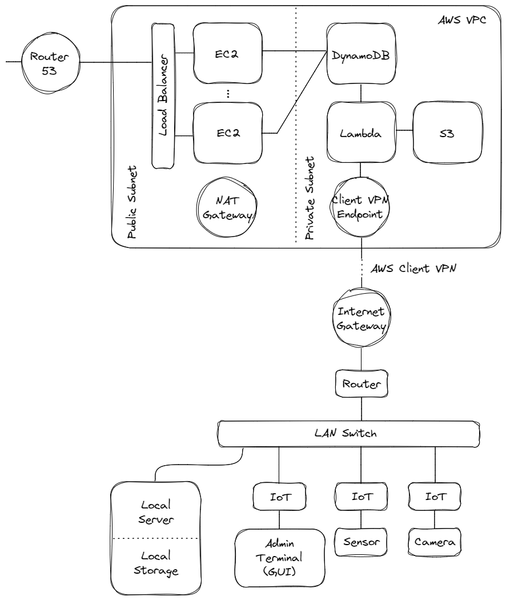

# Project: Smart Home

This project provides a smart home solution. Details are given in the rest of this README document. Source codes are given in the GitHub repository.

Acknowledgement: This project is jointly developed by Sun Lu and Xing Zhe.

---

## Introduction

TBA

## Architecture Design

The project adopts a 3-layer structure, namely the IoT, the (local) server, and the cloud platform layers.

The IoT devices collect measurements such as temperature, humidity, illumination and images, and subsequently upload them to the server. Some of them also provides HMI to the residents.

The server hosts a smart home management system that provides data acquisition, database and network-attached storage services. A graphical interface running on a webpage is developed in the server, which can be accessed using a browser from the LAN.

The server is configured as a gateway to the Amazon Web Services cloud platform. The cloud platform archives the data generated from the smart home and provides remote access to the smart home management system.

Each above layer is associated with an human-machine interface. Some of the IoT devices may provide simple interfaces, allowing the residents to quickly check and control some of the sensors and actuators deployed in the home. The server provides a web based interface that allows the residents to interact with the smart home management system. Finally in the upper layer, the cloud provides an interface for remote access to the smart home management system as well as checking archived data.

### General Architecture Design

The architecture of the solution of the project is given below.



Local to the home, a router and a switch are used to create the LAN/WLAN network. A local server, together with local storages, is deployed to provide local services such as access management, local database, graphical user interface, etc. The local server and storages should function normally in the case of an internet blackout.

Microcomputer/microcontroller based IoT devices are deployed to provide distributed monitoring and control services. For example, in the temperature and air quality control service, temperature and humidity sensors are installed on the IoT devices distributed in different rooms, using which data is collected, analyzed, then used for the control of air conditioners, dehumidifiers and purifiers. 

AWS is used to provide cloud services. AWS Client VPN is used for secure connection between the local system and the cloud system. Data collected from the smart home is periodically uploaded to the cloud for analysis. Database and data archive functions are integrated into the cloud system. A webpage is deployed for remote access to the smart home.

### Architecture Designs of Each Component

The architecture designs of the main components of the solution, namely the IoT devices, the local server and storage system, and the cloud system, are introduced as follows.

#### IoT Devices

TBA

#### Local Server and Storage

TBA

#### Cloud

TBA

## IoT Service: Temperature and Air Quality Control

TBA

## IoT Service: Illumination Control

TBA

## IoT Service: Hazards and Risks Detection

TBA

## Centralized Service: Smart Home Management System

### Web Interface

A web server is deployed in a container, on which a web interface is developed. PHP is used in the programming of the web interface. Details are given below.

Apache is used as the website server. Make sure that the latest version of its corresponding docker image, `httpd`, is downloaded to the machine. To download and update the `httpd` image, use the following
```bash
docker pull httpd
```


## Cloud Service: Data Archive and Remote Access to Smart Home Management System

TBA

## Conclusions

TBA

## Appendix

Basic setups, backgrounds, list of materials and project budget are given in the Appendix.

### Local Server Setup

Beelink Mini PC Wi11 Pro, Mini S with Ubuntu 22.04 LTS (minimal installation) is used as the starting point of the smart home local server. Upon completion of installation, the PC shall have a sudo user and a hostname, and shall have internet connection.

The following installations form the basis of the server infrastructure, and only after they are installed can we proceed with other software installations. 

```bash
# update system
sudo apt update; sudo apt upgrade

# install c compiler
sudo apt install gcc

# install curl
sudo apt install curl

# install net-tools
sudo apt install net-tools

# install and configure git
sudo apt install git
git config --global user.name 'sunlu'
git config --global user.email sunlu.electric@gmail.com

# install vim
sudo apt install vim

# install vim.plug and configure vim
curl -fLo ~/.vim/autoload/plug.vim --create-dirs \
    https://raw.githubusercontent.com/junegunn/vim-plug/master/plug.vim
curl "https://raw.githubusercontent.com/sunluelectric/smart-home/master/configs/.vimrc" > ~/.vimrc
vim +PlugInstall +qall

# install ssh client and server, and enable server
sudo apt install openssh-client
sudo apt install openssh-server
sudo systemctl enable ssh --now
sudo systemctl start ssh
```

For the convenience of project development, the repository on GitHub, sunluelectric/smart-home, is cloned to the server as follows.

Follow the instructions given by GitHub given [here](https://docs.github.com/en/authentication/connecting-to-github-with-ssh/generating-a-new-ssh-key-and-adding-it-to-the-ssh-agent) to generate SSH key pair and register the public key at GitHub. Use `git clone` to clone the project folder to the server.

The following installations form the basic development environment in the server. The “centralized intelligence” of the server will be built from these installations, and shared among all the services the server is to provide. 

```bash
# install and configure Python
sudo apt install python3
sudo apt install python-is-python3

# install miniconda
cd ~/Downloads
wget https://repo.anaconda.com/miniconda/Miniconda3-py310_22.11.1-1-Linux-x86_64.sh # Go to miniconda website to find the latest link
bash Miniconda3-py310_22.11.1-1-Linux-x86_64.sh # Use the downloaded file name
# (restart shell)
conda activate base
conda update conda
# create environment
conda create --name smart-home-dev # smart home development general environment
conda activate smart-home-dev
conda install conda
# install useful packages in environment smart-home-dev
conda install numpy scipy pandas
conda install scikit-learn
conda install matplotlib
conda install jupyter
conda install tensorflow pytorch
# disable conda auto activate
conda config --set auto_activate_base false
# deactivate conda environment
conda deactivate

# install R language
sudo apt update; sudo apt upgrade
sudo apt install r-base

# install octave and its packages
cd
sudo apt install octave
sudo apt install octave-control octave-image octave-io octave-optim octave-signal octave-statistics

```

Notice that since no monitor is connected to the server in most occasions, it makes no point starting a jupyter notebook on a local browser. It is possible to run jupyter notebook on the server, and access it remotely as follows.

```bash
conda activate smart-home-dev
jupyter notebook --no-browser --port=8080 --ip=0.0.0.0
```

Then in the remote machine, open a web browser and use URL `http://<server-ip>:8080` to access the jupyter notebook remotely.

Install MariaDB as follows. In this project, MariaDB is the main DBMS to be adopted in the server.

```bash
# install mariadb
sudo apt update
sudo apt install mariadb-server
sudo systemctl start mariadb.service
# check mariadb status using sudo systemctl status mariadb
# configure mariadb secure installation
sudo mysql_secure_installation
# install development kit for future Python connection
sudo apt install libmariadb-dev
```

Upon successful installation and configuration of MariaDB, login to MariaDB using `sudo mariadb`, and create an admin user as follows.

```sql
MariaDB [(none)]> GRANT ALL PRIVILEGES ON *.* TO '<user-name>'@'localhost' IDENTIFIED BY '<user-password>' WITH GRANT OPTION;
MariaDB [(none)]> FLUSH PRIVILEGES;
```

Should there be remote database access requirement, grand a user with a remote IP address the above privileges. Configure MariaDB configuration file (usually `/etc/mysql/my.conf`) to disable binding address by adding

```sql
[mysqld]
skip-networking=0
skip-bind-address
```

to the file.


Finally, install docker engine as follows. Containerization is used to logically separate and enhance portability of the upper-layer functions and services, such as hosting a web page or a statistics dashboard.

```bash
# install docker engine
sudo apt remove docker docker-engine docker.io
sudo apt remove containerd runc
sudo apt update
sudo apt install ca-certificates curl gnupg lsb-release
sudo mkdir -p /etc/apt/keyrings
curl -fsSL https://download.docker.com/linux/ubuntu/gpg | sudo gpg --dearmor -o /etc/apt/keyrings/docker.gpg
echo \
  "deb [arch=$(dpkg --print-architecture) signed-by=/etc/apt/keyrings/docker.gpg] https://download.docker.com/linux/ubuntu \
  $(lsb_release -cs) stable" | sudo tee /etc/apt/sources.list.d/docker.list > /dev/null
sudo apt update
sudo apt install docker-ce docker-ce-cli containerd.io docker-compose-plugin
# test docker installation by running sudo docker run hello-world
sudo usermod <user-name> -aG docker
```

The following services are executed in containers in the local server.

### Brief Introduction to TensorFlow and TensorFlow Lite

TensorFlow and TensorFlow Lite are heavily used in the development of the project as the main artificial intelligence engines. Some introductions and examples to these tools are introduced0 as follows.

#### TensorFlow

TensorFlow is one of the widely used ANN engines. It provides simple, yet powerful and flexible APIs and tools for different use cases and can be customized to meet needs of the users.

Here, we are focusing on using TensorFlow to solve object detection problems. The examples are given from Valliappa Lakshmanan’s book titled *Practical Machine Learning for Computer Vision: End-to-End Machine Learning for Images*.

Arthropod Taxonomy Orders Object Detection dataset from [Kaggle](https://www.kaggle.com/) is used in the example. Three different solutions, namely **You-Only-Look-Once (YOLO)**, **RetinaNet** and **Mask R-CNN** are discussed. Relevant models can be found at [TensorFlow Model Garden's official model repository (github.com)](https://github.com/tensorflow/models/tree/master/official).

Tests are carried out using [Google Colaboratory (google.com)](https://colab.research.google.com/), a platform for easily deploying Python based ANN.

**You-Look-Only-Once (YOLO)**

YOLO implementation is simple and fast, thus used widely in embedded systems. The latest YOLO research and implementation can be found as follows:

- YOLOv1 (original YOLO): [[1506.02640] You Only Look Once: Unified, Real-Time Object Detection (arxiv.org)](https://arxiv.org/abs/1506.02640)
- YOLOv2: [[1612.08242] YOLO9000: Better, Faster, Stronger (arxiv.org)](https://arxiv.org/abs/1612.08242)
- YOLOv3: [[1804.02767] YOLOv3: An Incremental Improvement (arxiv.org)](https://arxiv.org/abs/1804.02767)
- YOLOv4: [[2004.10934] YOLOv4: Optimal Speed and Accuracy of Object Detection (arxiv.org)](https://arxiv.org/abs/2004.10934)
- YOLOv5: [YOLOv5 (github.com)](https://github.com/ultralytics/yolov5)

Some highlights of the original YOLOv1 are given below.

- CNNx24 + DENSEx2
- “Grid cells” of number SxS (by default 7x7) are introduced, which divide the image into multiple portions.
- Each cell detects an object whose ground truth box center is within the cell.
- The last layer of the ANN decides the probability and boundary box coordinates of an item.
- An internal variable, namely the “confidence”, is defined as the product of “the probability that there is an item in the boundary box” and “the overlapping between the boundary box and the ground true box”.
    
    To get a higher score, the boundary box needs to contain an effective item, and at the same time overlap the ground true box as close as possible. (Notice that both item classes and ground true boxes are known labels of an image.)
    
    When an item is associated with multiple boundary boxes, the one with the highest confidence score is eventually selected. This means that the ANN needs to predict the ground true box internally as well.
    
- Cost function consists of two components, the classification error and the boundary box coordinate error. For boundary box coordinate, only the selected box receives penalty, i.e., the boxes with wrong coordinates but not selected does not affect the cost function.

YOLOv2-YOLOv5 improve the performance of the system by adopting different network structures and advanced technologies. Some highlights are as follows.

- Batch normalization for faster training.
- Larger size CNN, including the use of larger and larger residual neural network (ResNet) with skip connection feature. Skip connection feature helps to reduce the weight vanishing effect in a deep network.
- The use of object detectors that extract information from different layers (instead of only from the bottom layer) of CNN.

There is another technique for object detection, with a similar name You Only Learn One Representation (YOLOR). Details are given at [[2105.04206] You Only Learn One Representation: Unified Network for Multiple Tasks (arxiv.org)](https://arxiv.org/abs/2105.04206), [YOLOR (github.com)](https://github.com/WongKinYiu/yolor).

Notice that TensorFlow may not be well supported for all YOLO versions. For example, YOLOv5 is well supported for PyTorch usage, but not for TensorFlow.

#### TensorFlow Lite

TensorFlow Lite is the on-device machine learning interface optimized for mobile, embedded and edge devices for tasks including image classification, object detection, text classification, audio classification, and speech recognition, etc.

Different from a conventional TensorFlow implementation, TensorFlow Lite does not focus on model building and training, but rather using existing models either downloaded from the community (for example, from [Pre-trained models for TensorFlow Lite](https://www.tensorflow.org/lite/models/trained)) or converted from a TensorFlow model.

Notice that it is also possible to create simple customizable models using TensorFlow Lite Model Maker.

End-to-end examples of implementing TensorFlow Lite on embedded Linux systems can be found at [TensorFlow Lite Examples](https://www.tensorflow.org/lite/examples). 

Here, the object detection on Raspberry Pi is used as an example to illustrate the installation and basic use of TensorFlow Lite. More details are given at [object detection Raspberry Pi (github.com)](https://github.com/tensorflow/examples/tree/master/lite/examples/object_detection/raspberry_pi).

> The copyright of all the codes used in this example belongs to:
> 
> 
> ```python
> # Copyright 2021 The TensorFlow Authors. All Rights Reserved.
> #
> # Licensed under the Apache License, Version 2.0 (the "License");
> # you may not use this file except in compliance with the License.
> ```
> 

Notice that the PiCamera shall be configured correctly as a prerequisite before running the example. The configuration of PiCamera is given elsewhere in [IoT Service: Hazards and Risks Detection](https://www.notion.so/IoT-Service-Hazards-and-Risks-Detection-fb07207742704feca3e5f13ab4774389).

**Installation of TensorFlow Lite**

Assume that Python is already installed in the system, and `python3`  used to execute Python. Use the following commands to install TensorFlow Lite.

```bash
$ python3 -m pip install pip --upgrade
$ python3 -m pip install -r argparse, numpy, opencv-python
$ python3 -m pip install -r tflite-runtime, tflite-support, protobuf
```

**Downloading Models**

Pre-trained models are used in this example. Use the following commands to download the models used in this example.

```bash
curl \
    -L 'https://storage.googleapis.com/download.tensorflow.org/ \
				models/tflite/task_library/object_detection/rpi/ \
				lite-model_efficientdet_lite0_detection_metadata_1.tflite' \
    -o ./efficientdet_lite0.tflite
curl \
    -L 'https://storage.googleapis.com/download.tensorflow.org/ \
				models/tflite/task_library/object_detection/rpi/ \
				efficientdet_lite0_edgetpu_metadata.tflite' \
    -o ./efficientdet_lite0_edgetpu.tflite
```

The `.tflite` are the trained models to be used in the example.

**Executing Object Detection Program**

Run the following command to execute the object detection program.

```bash
$ python3 detect.py --model efficientdet_lite0.tflite
```

where `[detect.py](http://detect.py)` is given by

```python
import argparse
import sys
import time

import cv2
from tflite_support.task import core
from tflite_support.task import processor
from tflite_support.task import vision
import utils

def run(model: str, camera_id: int, width: int, height: int, num_threads: int,
        enable_edgetpu: bool) -> None:
  """Continuously run inference on images acquired from the camera.
  Args:
    model: Name of the TFLite object detection model.
    camera_id: The camera id to be passed to OpenCV.
    width: The width of the frame captured from the camera.
    height: The height of the frame captured from the camera.
    num_threads: The number of CPU threads to run the model.
    enable_edgetpu: True/False whether the model is a EdgeTPU model.
  """

  # Variables to calculate FPS
  counter, fps = 0, 0
  start_time = time.time()

  # Start capturing video input from the camera
  cap = cv2.VideoCapture(camera_id)
  cap.set(cv2.CAP_PROP_FRAME_WIDTH, width)
  cap.set(cv2.CAP_PROP_FRAME_HEIGHT, height)

  # Visualization parameters
  row_size = 20  # pixels
  left_margin = 24  # pixels
  text_color = (0, 0, 255)  # red
  font_size = 1
  font_thickness = 1
  fps_avg_frame_count = 10

  # Initialize the object detection model
  base_options = core.BaseOptions(
      file_name=model, use_coral=enable_edgetpu, num_threads=num_threads)
  detection_options = processor.DetectionOptions(
      max_results=3, score_threshold=0.3)
  options = vision.ObjectDetectorOptions(
      base_options=base_options, detection_options=detection_options)
  detector = vision.ObjectDetector.create_from_options(options)

  # Continuously capture images from the camera and run inference
  while cap.isOpened():
    success, image = cap.read()
    if not success:
      sys.exit(
          'ERROR: Unable to read from webcam. Please verify your webcam settings.'
      )

    counter += 1
    image = cv2.flip(image, 1)

    # Convert the image from BGR to RGB as required by the TFLite model.
    rgb_image = cv2.cvtColor(image, cv2.COLOR_BGR2RGB)

    # Create a TensorImage object from the RGB image.
    input_tensor = vision.TensorImage.create_from_array(rgb_image)

    # Run object detection estimation using the model.
    detection_result = detector.detect(input_tensor)

    # Draw keypoints and edges on input image
    image = utils.visualize(image, detection_result)

    # Calculate the FPS
    if counter % fps_avg_frame_count == 0:
      end_time = time.time()
      fps = fps_avg_frame_count / (end_time - start_time)
      start_time = time.time()

    # Show the FPS
    fps_text = 'FPS = {:.1f}'.format(fps)
    text_location = (left_margin, row_size)
    cv2.putText(image, fps_text, text_location, cv2.FONT_HERSHEY_PLAIN,
                font_size, text_color, font_thickness)

    # Stop the program if the ESC key is pressed.
    if cv2.waitKey(1) == 27:
      break
    cv2.imshow('object_detector', image)

  cap.release()
  cv2.destroyAllWindows()

def main():
  parser = argparse.ArgumentParser(
      formatter_class=argparse.ArgumentDefaultsHelpFormatter)
  parser.add_argument(
      '--model',
      help='Path of the object detection model.',
      required=False,
      default='efficientdet_lite0.tflite')
  parser.add_argument(
      '--cameraId', help='Id of camera.', required=False, type=int, default=0)
  parser.add_argument(
      '--frameWidth',
      help='Width of frame to capture from camera.',
      required=False,
      type=int,
      default=640)
  parser.add_argument(
      '--frameHeight',
      help='Height of frame to capture from camera.',
      required=False,
      type=int,
      default=480)
  parser.add_argument(
      '--numThreads',
      help='Number of CPU threads to run the model.',
      required=False,
      type=int,
      default=4)
  parser.add_argument(
      '--enableEdgeTPU',
      help='Whether to run the model on EdgeTPU.',
      action='store_true',
      required=False,
      default=False)
  args = parser.parse_args()

  run(args.model, int(args.cameraId), args.frameWidth, args.frameHeight,
      int(args.numThreads), bool(args.enableEdgeTPU))

if __name__ == '__main__':
  main()
```

and `[utils.py](http://utils.py)` by

```python
import cv2
import numpy as np
from tflite_support.task import processor

_MARGIN = 10  # pixels
_ROW_SIZE = 10  # pixels
_FONT_SIZE = 1
_FONT_THICKNESS = 1
_TEXT_COLOR = (0, 0, 255)  # red

def visualize(
    image: np.ndarray,
    detection_result: processor.DetectionResult,
) -> np.ndarray:
  """Draws bounding boxes on the input image and return it.
  Args:
    image: The input RGB image.
    detection_result: The list of all "Detection" entities to be visualize.
  Returns:
    Image with bounding boxes.
  """
  for detection in detection_result.detections:
    # Draw bounding_box
    bbox = detection.bounding_box
    start_point = bbox.origin_x, bbox.origin_y
    end_point = bbox.origin_x + bbox.width, bbox.origin_y + bbox.height
    cv2.rectangle(image, start_point, end_point, _TEXT_COLOR, 3)

    # Draw label and score
    category = detection.categories[0]
    category_name = category.category_name
    probability = round(category.score, 2)
    result_text = category_name + ' (' + str(probability) + ')'
    text_location = (_MARGIN + bbox.origin_x,
                     _MARGIN + _ROW_SIZE + bbox.origin_y)
    cv2.putText(image, result_text, text_location, cv2.FONT_HERSHEY_PLAIN,
                _FONT_SIZE, _TEXT_COLOR, _FONT_THICKNESS)

  return image
```

For the above two introductions, the special thanks go to:

- Lakshmanan, Valliappa, Martin Görner, and Ryan Gillard. *Practical Machine Learning for Computer Vision*. "O'Reilly Media, Inc.", 2021.
- [TensorFlow Lite | ML for Mobile and Edge Devices](https://www.tensorflow.org/lite).

Many source codes, models and examples used in these introductions are from either the above resources, or the TensorFlow GitHub repository [tensorflow (github.com)](https://github.com/tensorflow).

### Timeline and Budget

The project shall be completed by June 30, 2023, and the total budget planned for this project is 1000 SGD. The budget is used to purchase servers, IoT devices, and subscriptions of online resources.

| Item | Cost (S$) |
| --- | --- |
| Beelink Mini PC Wi11 Pro, Mini S | 179.25 |
| TOTAL | 179.25 |